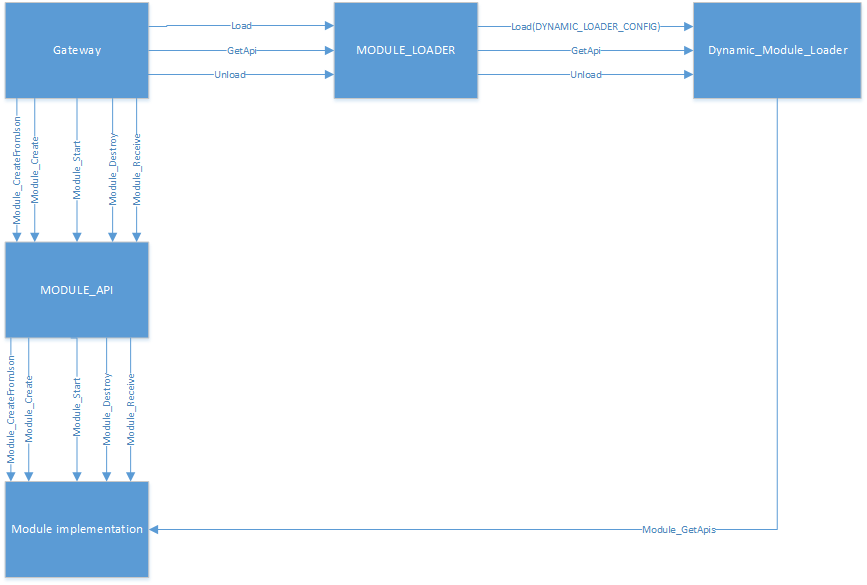

Module Loading
==============

High level design
-----------------

### Overview

The Azure IoT Gateway starts with the assumption that the operating system and 
the target platform supports the loading of modules at run-time through shared 
libraries.  This assumption works well on most platforms, but not all. The 
module loading is abstracted to allow all platforms a pattern to connect modules to the gateway.

This document will begin with a desciption of how module loading works in the 
default module loader when the gateway is created using 
`Gateway_CreateFromJson`. Then this document will describe the necessary 
components to provide a new loader for the gateway.

### MODULE\_API

The entry point for all modules in the Azure IoT Gateway is the `MODULE_API` 
structure, received by calling the `Module_GetApi` function, the only exported 
function in the shared library.  The point of all module loaders is to provide 
this `MODULE_API` for the gateway.

Please see [the module requirements](module.md) for more information on the 
`MODULE_API` usage.


### Default Module Loader Operation



Reference: [Dynamic loader requirements.](dynamic_loader_requirements.md)

### Gateway\_CreateFromJson

`Gateway_CreateFromJson` expects each module will have a "loading args" entry. 
The "loading args" entry is another JSON object containing one field, "module 
path".

The "module path" field will be a file name pointing to the shared library file 
(.DLL/.so) that contains the module implementation. 

```json
{
    "module name" : "<<module name>>",
    "loading args" : 
        {
            "module path" : "<<path to shared library>>"
        },
    "args" : ...
}
```

`Gateway_CreateFromJson` will parse the JSON and get the "module path" for each 
module entry. It will then put the module path into a `DYNAMIC_LOADER_CONFIG` 
stucture and assign its pointer to 
`GATEWAY_MODULES_ENTRY::loader_configuration`. It will then assign `GATEWAY_MODULES_ENTRY::loader_api` to the default dynamic loader `DynamicLoader_GetApi`.

Once the JSON parsing is complete, and all the `GATEWAY_MODULES_ENTRY`s have 
been put into the `GATEWAY_PROPERTIES` structure, `Gateway_CreateFromJson` will 
call `Gateway_Create`.

### Gateway\_Create

In order to get the `MODULE_API` for each module, `Gateway_Create` 
will call the `GATEWAY_MODULES_ENTRY::loader_api->Load` function, passing in  
`GATEWAY_MODULES_ENTRY::loader_configuration`, to get the library handle.  Then 
it will call the `GetApi` function with the new library handle.

### DynamicLoader\_GetApi

`DynamicLoader_GetApi` implements the `MODULE_LOADER_API` API. When `Load` is 
called, it will take the module path and load the shared library using the 
OS-specific function, and return a `MODULE_LIBRARY_HANDLE`.

When `GetApi` is called, it will return a pointer to a MODULE_API structure.

When `Unload` is called, it will unload the shared libray using the OS-specific 
function, and deallocate the `MODULE_LIBRARY_HANDLE`.

## Writing a custom module loader.

When calling `Gateway_CreateFromJson`, all modules are by default loaded with 
the `DynamicLoader_GetApi`. However, you may specify a different module loader 
if you create your own vector of `GATEWAY_MODULES_ENTRY`, assign your custom 
`MODULE_LOADER_API` call `Gateway_Create` directly. A custom module loader 
needs to implement all the functions in the `MODULE_LOADER_API` structure:

```c
/** @brief function table for loading modules into a gateway */
typedef struct MODULE_LOADER_API
{
    /** @brief Load function, loads module for gateway, returns a valid handle on success */    
    MODULE_LIBRARY_HANDLE (*Load)(const MODULE_LOADER* loader, void* config);
    /** @brief Unload function, unloads the library from the gateway */    
    void (*Unload)(const MODULE_LOADER* loader, MODULE_LIBRARY_HANDLE handle);
    /** @brief GetApi function, gets the MODULE_API for the loaded module */  
    const MODULE_API * (*GetApi)(const MODULE_LOADER* loader, MODULE_LIBRARY_HANDLE handle)
} MODULE_LOADER_API;
```

#### `MODULE_LOADER_API::Load`

This function is to be implemented by the module loader creator. 

`MODULE_LOADER_API::Load` accepts a void\* as input, and `Gateway_Create` will 
pass to the loader the `GATEWAY_MODULES_ENTRY::loader_configuration` for the 
module entry in `GATEWAY_PROPERTIES`.  The module handle should produce an 
opaque `MODULE_LIBRARY_HANDLE` which will be used for subsequent calls to 
`GetApi` and `Unload`.

If the function fails internally, it should return `NULL`.

#### `MODULE_LOADER_API::Unload`

This function is to be implemented by the module loader creator. 

`MODULE_LOADER_API::Unload` takes a `MODULE_LIBRARY_HANDLE` as input and does what 
is needed to unload the module from the gateway, it should deallocate all 
resources allocated by `MODULE_LOADER_API::Load`.

If parameter `handle` is `NULL` the function should return without taking any 
action.

#### `MODULE_LOADER_API::GetApi`

This function is to be implemented by the module loader creator. 

`MODULE_LOADER_API::GetApi` takes a `MODULE_LIBRARY_HANDLE` as input and returns a 
pointer to the `MODULE_API` structure needed for the gateway to access the 
module's functions.

If the function fails internally, it should return `NULL`.

### Calling the custom module loader.

The gateway creator would be responsible for constructing the 
`GATEWAY_PROPERTIES` vector, assigning a `MODULE_LOADER_API` for each module entry, and calling `Gateway_Create`.  See the [Gateway requirements](gateway_requirements.md) for details on this function.

